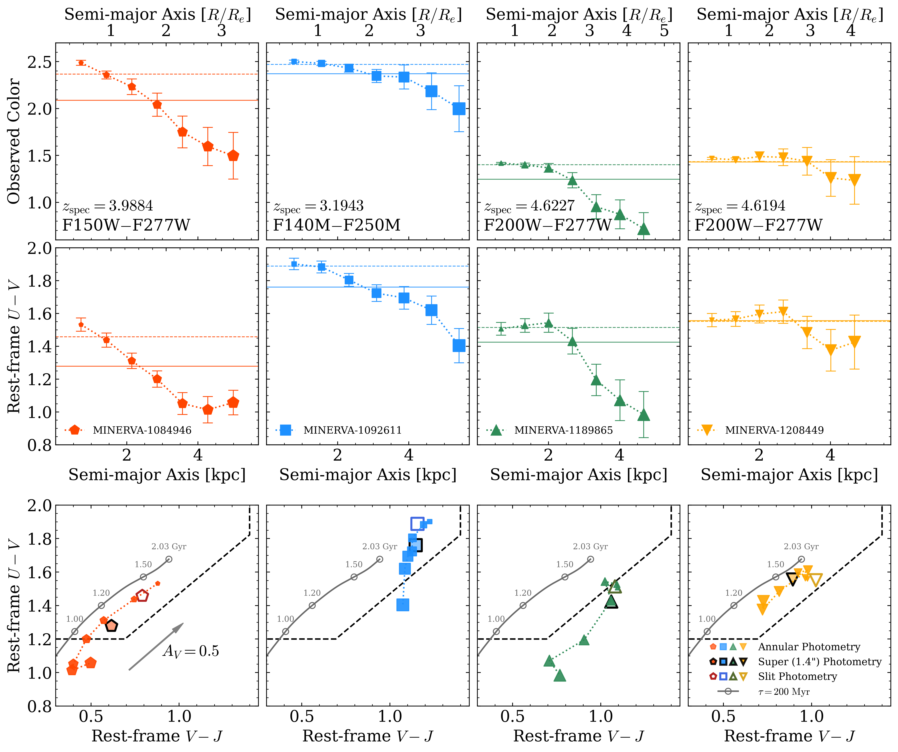

Using JWST medium-band photometry from the [MINERVA](https://minerva.colorado.edu/) treasury survey, this project characterizes spatially resolved stellar populations in massive quiescent galaxies at *z*>3 — a population whose extreme early formation timescales have created significant tensions with galaxy formation models.

## Cutler et al. 2026 — Color Gradients at *z*>3

[*The Astrophysical Journal Letters*, doi:10.3847/2041-8213/ae960c](https://ui.adsabs.harvard.edu/abs/2026ApJ..1008L..11C) | [arXiv:2606.02698](https://arxiv.org/abs/2606.02698)

We measure resolved photometry in a series of elliptical annuli out to 0.″7 (~4 *R*ₑ) for four log(*M*★/*M*☉)>11 quiescent galaxies at *z*>3, using MINERVA's medium-band NIRCam imaging to track the rest-frame *U* − *V* and *V* − *J* colors as a function of radius. Three of the four galaxies show clear **negative color gradients** (bluer outskirts, redder cores) consistent with inside-out assembly and declining stellar ages at larger radii.

For the steepest gradient (Δ(*U* − *V*)/Δ*R* = −0.126 ± 0.030 mag kpc⁻¹), the inferred stellar mass is **0.1 dex lower** than when measured within a fiducial NIRSpec slit, which samples only the galaxy core. Propagating this correction through extreme-value statistics models reduces the tension with ΛCDM predictions out to *z* ~ 9.5 — easing, though not eliminating, the too-early star formation problem.

These findings underscore the importance of integral field unit (IFU) spectroscopy for massive high-*z* quiescent galaxies: spatially resolved spectra are needed to break the age–dust–metallicity degeneracy and reliably disentangle the effects of color gradients from those of different physical modeling assumptions.
