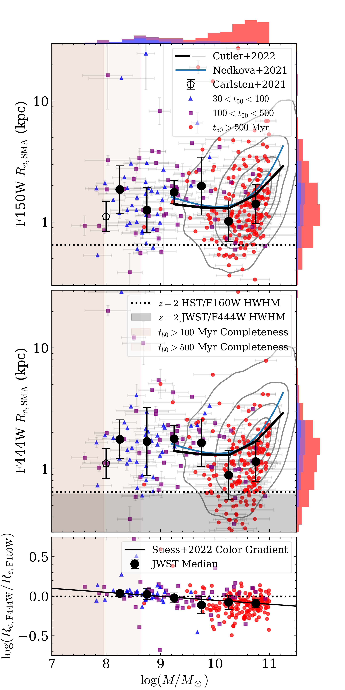

Using JWST's combination of sensitivity, spatial resolution, and red wavelength coverage, this project characterizes the sizes and structures of low-mass quiescent galaxies — a population largely inaccessible to HST — and traces how they evolve from cosmic noon to the present day.

## Cutler et al. 2024 — Two Distinct Classes at Cosmic Noon

[*The Astrophysical Journal Letters*, doi:10.3847/2041-8213/ad464c](https://ui.adsabs.harvard.edu/abs/2024ApJ...967L..23C/abstract) | [arXiv:2312.15012](https://arxiv.org/abs/2312.15012)

We measure the size–mass relation for 332 quiescent galaxies at 1 < *z* < 3 drawn from the JWST [PRIMER](https://primer-jwst.github.io) and [UNCOVER](https://jwst-uncover.github.io) treasury surveys. Galaxies are selected via rest-frame *UVJ* colors and specific star formation rate and modeled with GALFIT in both F150W (rest-frame UV/optical) and F444W (rest-frame near-infrared).

The result is an unambiguous flattening of the size–mass relation below log(*M*★/*M*☉) ~ 10.3, arising from a clean separation into **two distinct populations**:

- **Low-mass quiescent galaxies** — notably younger, with disky structures, suggesting quenching by environmental or feedback-driven mechanisms
- **Massive quiescent galaxies** — older, spheroidal morphologies consistent with merger-driven size growth

This transition mass coincides with characteristic scales in multiple other galaxy evolution relations (star formation efficiency, dust obscuration, stellar-to-halo mass ratio), reinforcing the stark dichotomy between low- and high-mass galaxy formation channels.

## Cutler et al. 2025 — Cluster Environments at *z* ~ 0.3

[*The Astrophysical Journal*, doi:10.3847/1538-4357/ae0629](https://ui.adsabs.harvard.edu/abs/2025ApJ...980..123C/abstract) | [arXiv:2504.10572](https://arxiv.org/abs/2504.10572)

Building on the cosmic noon results, we present the first JWST-based measurement of the quiescent size–mass relation down to dwarf masses (7 < log *M*★/*M*☉ < 10) in the *z* = 0.308 A2744 galaxy cluster, using spectrophotometric data from the UNCOVER and MegaScience programs. The sample of 1,531 quiescent cluster galaxies shows **significantly higher scatter** in the size–mass relation than comparable field samples, despite similar best-fit slopes, pointing to cluster-specific evolutionary processes.

We find tentative evidence that **older low-mass quiescent galaxies are more spheroidal**, consistent with a picture in which:

1. Low-mass star-forming galaxies enter the cluster with disky morphologies
2. Ram-pressure stripping quenches star formation from the outside in, preserving disk structure initially
3. Subsequent harassment and tidal interactions drive morphological transformation toward spheroids (UDGs and dwarf spheroidals)

This evolutionary sequence is illustrated in the cartoon below. The star formation histories of our cluster sample are consistent with quenching at *z* < 1.5, leaving ample time for post-quenching morphological evolution driven by the cluster environment — while disfavoring environment as the *trigger* of quenching.

