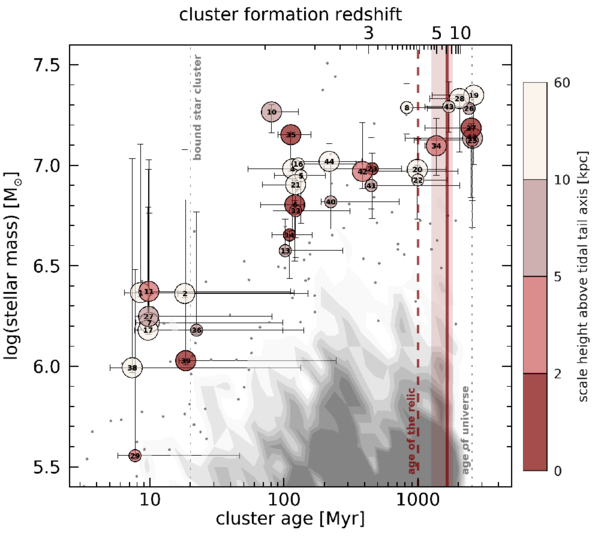
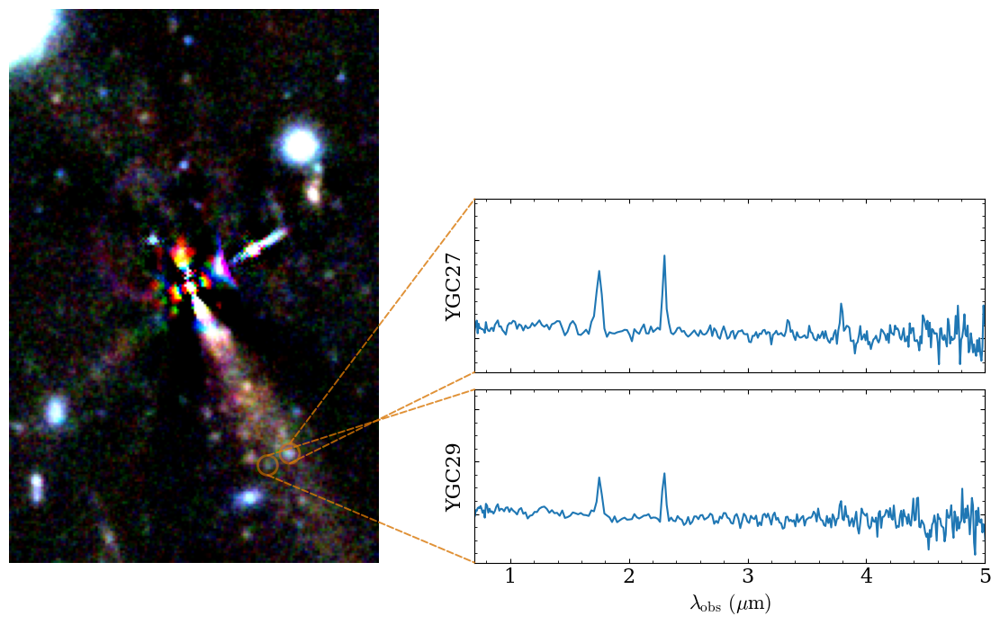

Enhanced sensitivity and spatial resolution from JWST+gravitational lensing allow us to detect and resolve candidate globular clusters (GCs) in a massive, z>2.5 quiescent galaxy: *The Relic*

## The Relic I: Photometric Analysis - Whitaker et al. 2026  

[*The Astrophysical Journal*, doi:10.3847/1538-4357/ae5177](https://ui.adsabs.harvard.edu/abs/2026ApJ..1001..107W/abstract) | [arXiv:2501.07627](https://arxiv.org/abs/2501.07627)

Using deep JWST imaging from UNCOVER and MegaScience, we discover 36 candidate GCs within the Relic, a massive quiescent galaxy at z=2.5 in the Abell 2744 lensing field. The clusters span formation ages from 8 Myr to ~2 Gyr, tracing a rich assembly history back to z~10, with masses of ~10⁶–10⁷ M☉ consistent with precursors to the most-massive present-day GCs. Their spatial distribution and low metallicities point to a combination of early *in situ* formation and later cluster accretion, providing the first direct link between high-redshift star cluster populations and local GCs.

## The Relic II: IFU PRISM Spectroscopy - Cutler et al. in prep.

We obtained deep (14.5 hr) NIRSpec/IFU PRISM spectroscopy for the Relic in Cycle 3 (JWST-GO-6405, PIs: Cutler/Whitaker). Following initial data reduction, we found distinct emission lines (e.g., Hα+\[NII\], \[OIII\]+Hβ) in two young, blue GCs. Using spectrophotometric modeling, we confirmed the redshift of these GCs to be consistent with the cluster and found ages as young as 6 Myr. Notably, **these young GCs show significant HeI 10830 emission**, suggesting self-enrichment from:

1. Active enrichment from very massive star or Wolf-Rayet stellar winds
2. Enrichment of birth gas prior to star formation
3. Delayed enrichment after the first ~2 Myr

